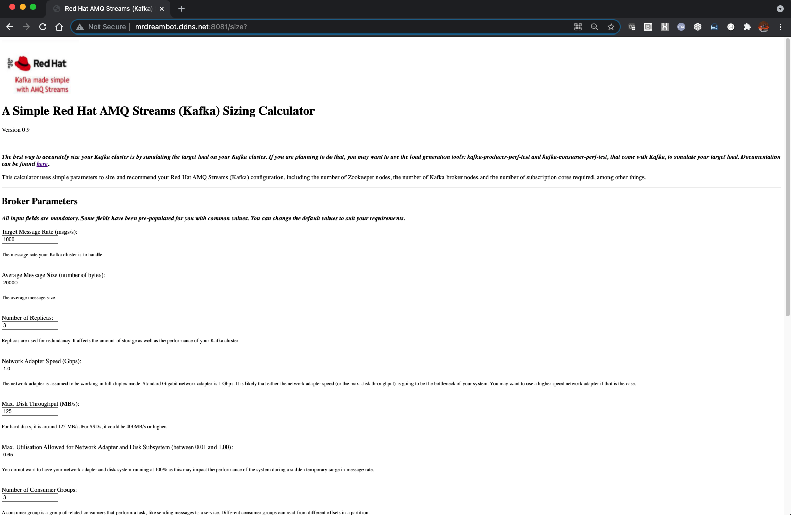
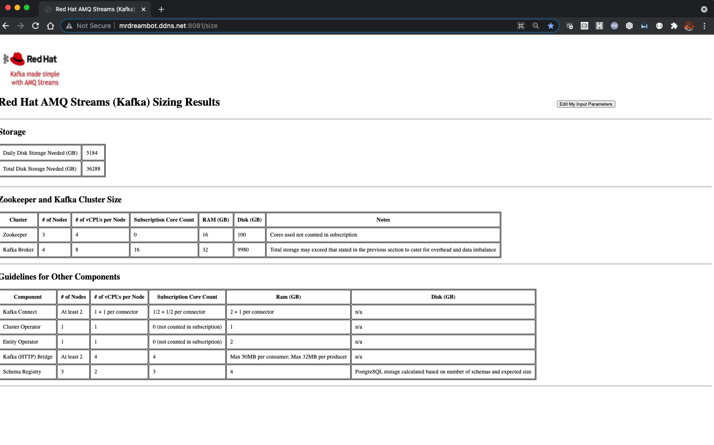
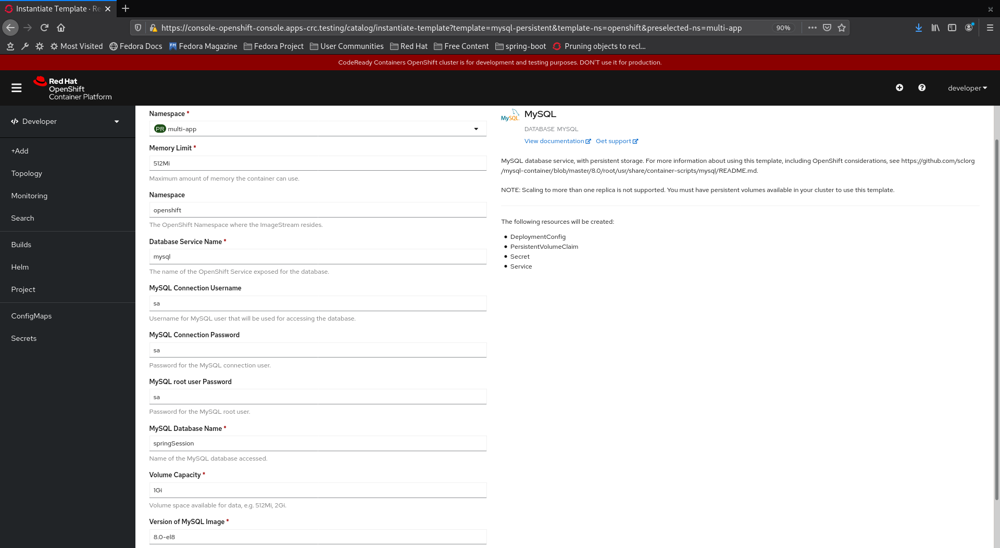
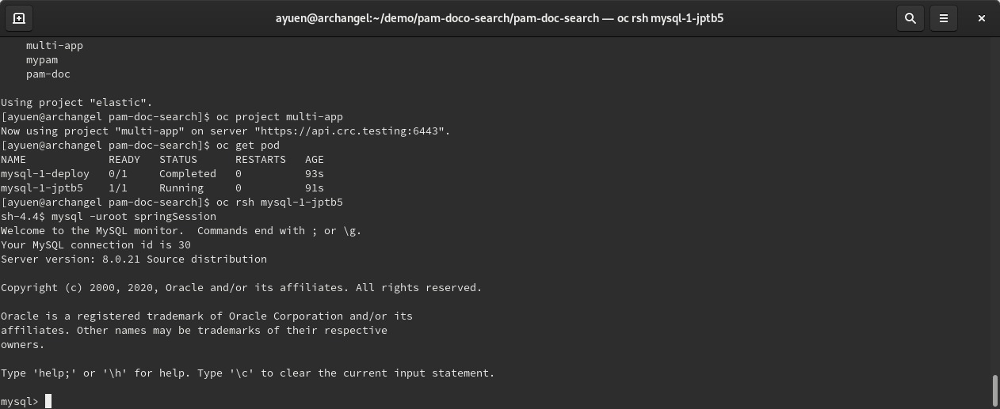
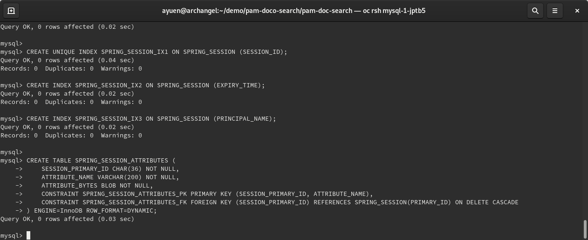

# An AMQ Streams (Kafka) Sizing Tool

_You can access my Kafka sizing tool using the link 
[here](https://kafkasizing.azurewebsites.net/size?)._

Note that the first time you access it, it may timeout or take a long time as the container would have been stopped due to inactivity.

Also, the calculator will give a preconfigured minimum even if your input requirements require less resources. We are talking about enterprise env here.

## Problem statement
Enterprises planning to use Red Hat AMQ Streams (Kafka) want to get an idea as to how many subscription cores they need to purchase. The intention of this tool is to provide an educated estimate. Nothing beats simulating the load on your hardware but this is not always feasible. The next best thing is to develop an analytical model to do the estimation.

## An Analytical Model
It will take up too much space here to describe the analytical model I used for this sizing tool. Instead, I have included it in the repository: "AMQ Streams (Kafka) Sizing Tool - Analytical Model.pdf", for those who are interested. 

## User Interface and Sizing Output
Here is a screenshot of the UI:

Here is a screenshot of the sizing results:

## Running Spring Boot Locally
<pre>
    mvn clean spring-boot:run
</pre>

## Deploying to Openshift
Do the following:
* Log in to Openshift
* Create a new Openshift project: kafka-sizing
* Make sure you are on that project
* Deploy a MySQL database and set it up with the schema using the schema-mysql.sql (see screenshots in next section).
* On your laptop, change to the root of your kafka-sizing maven project and execute the following commands:
<pre>
	mvn clean -Pprod package
	oc project kafka-sizing
	oc policy add-role-to-user view -z default
	oc create configmap kafka-sizing --from-file=target/classes/application.properties
	mvn oc:build
	mvn oc:resource
	mvn oc:apply
</pre>

Please note that you need to execute the package mvn goal before creating the configmap as mvn changes the application.properties file before copying it to the target directory.
* invoke the application using its route

## Database Deployment Screenshots
* Use Openshift templates to create a MySQL database with persistent storage.

* Identify the MySQL pod, rsh into it and login to MySQL as root:

* Paste the SQL script to create the schema

## ENJOY ;-) !!! 
